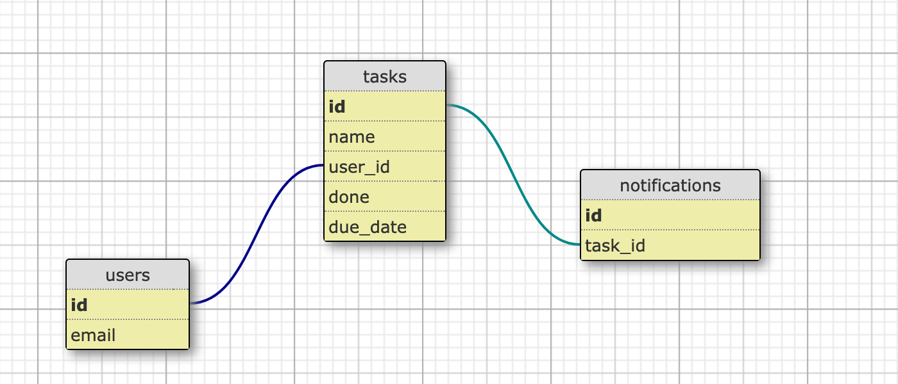

## Système de Notification

Voici une proposition du schema de la base de données:




Ajouter tous les assocations nécessaires dans les models

```ruby
class User
  has_many :tasks
  has_many :notifications, through: :tasks
end
```

```ruby
class Task
  belongs_to :user
  has_many :notifications
end
```


```ruby
class Notification
  belongs_to :task
  scope :with_pending_tasks, -> { joins(:tasks).where('tasks.done = false') }
end
```

### A. Les notifications sont visibles partout dans l'application (à droite sur la navbar) : l'onboardee peut les consulter.

1. Accessibilité des notifications via une API:

```ruby
  resources :notifications, only: [:index]
```

2. Récupération des notifications d'un user `NotificationsController`

```ruby
def index
  @notifications = current_user.notifications.with_pending_tasks
end
```

3. Affichage des notifications:

En Ajax (pour optimiser le chargement de la page), récupérer la liste des notifications via l'api `/notifications` et ensuite les afficher.

4. Création des notifications.

Dans un fichier `lib/create_notifications.rb`:
- Créer une tâche qui récupèrent toutes les tâches non faites de la veille et créent des notifications.
- La tâche serait codée de cette façon:

```ruby
Task.where(done: false, due_date: Date.yesterday).each do |task|
  Notification.create!(task: task)
end
```

- Avec la `gem whenever`, programmer cette tâche tous les jours à '00:01'


### B. Les notifications sont envoyées une fois par semaine, le mardi, à l'onboardee par email.


1. Création d'une tâche récurrente

Dans un fichier `lib/send_pending_notifications.rb`:
```ruby
  Notification.with_pending_tasks.users.uniq.each do |user|
    NotifyOnboardee(user, user.notifications).perform_later
  end
```


Créer un job dans un fichier `app/jobs/notify_onboardee.rb`

```ruby
class NotifyOnboardee < ApplicationJob
  queue_as :default

  def perform(recipient, notifications)
    NotificationMailer.submission(recipient, notifications).deliver
  end
end
```

2. Avec la `gem whenever`, programmer cette tâche tous les mardi à '02:00'
